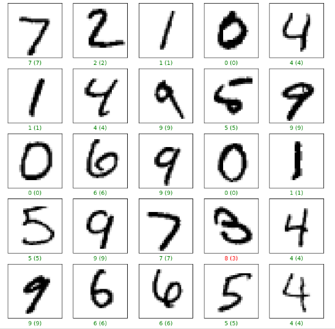

# Digit_Recognizer_Keras
## python 3.9.*
## git clone https://github.com/mohammed3120/Digit_Recognizer_Keras.git
## python -m venv venv
## cd venv
## venv/script/active
## pip install -r requirements.txt
#### ------------------------------

